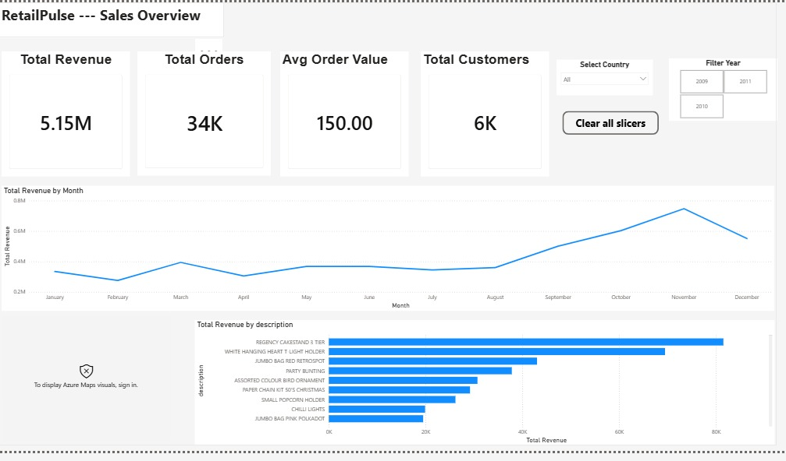
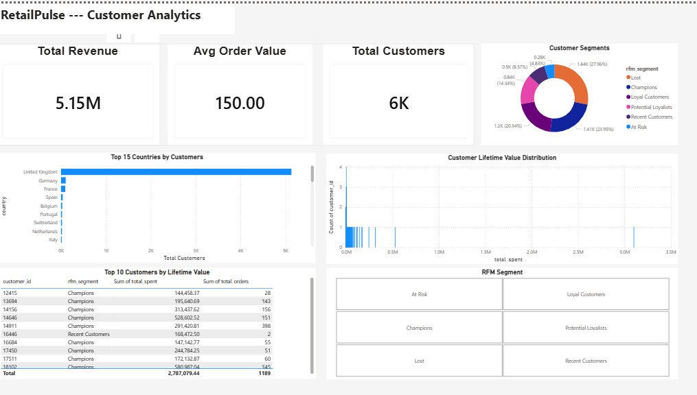
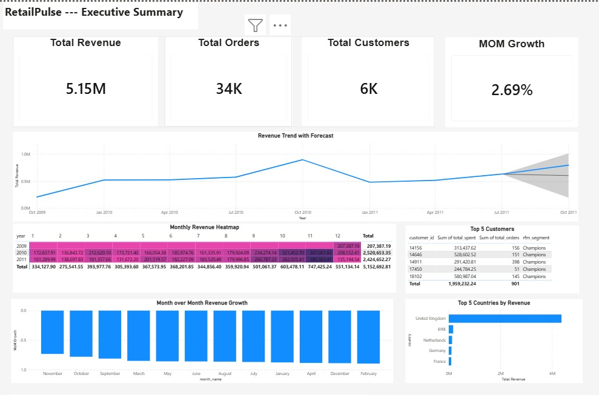
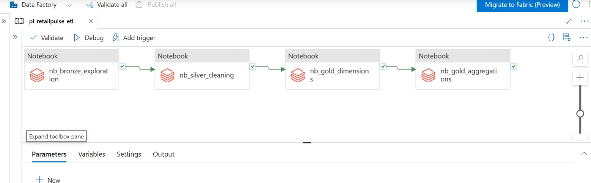

# RetailPulse
Cloud-native Business Intelligence platform for e-commerce analytics, built on Microsoft Azure.

---

## Overview

RetailPulse is an end-to-end Azure analytics platform that ingests raw e-commerce transaction data, transforms it through a medallion architecture (Bronze, Silver, Gold), loads it into a star schema data warehouse, and surfaces business insights through interactive Power BI dashboards.

**Dataset:** UCI Online Retail II — 1,067,371 real UK e-commerce transactions (2009–2011)  
**Clean records after processing:** 1,007,913 rows  
**Total revenue analysed:** 5.15 million GBP  

---

## Architecture

```
UCI Online Retail II (CSV)
         |
         v
Azure Blob Storage          <- Raw data landing zone
(raw-data container)
         |
         v
Azure Data Factory          <- Pipeline orchestration
(pl_retailpulse_etl)
         |
         v
Azure Databricks
  Bronze  ->  Silver  ->  Gold
  (raw)      (clean)    (aggregated)
         |
         v
Azure SQL Database          <- Star schema data warehouse
  fact_transactions
  dim_customers
  dim_products
  dim_date
  agg_daily_sales
  agg_customer_metrics
         |
         v
Power BI                    <- 3 interactive dashboards
```

---

## Tech Stack

| Layer | Technology |
|---|---|
| Cloud Platform | Microsoft Azure |
| Data Storage | Azure Blob Storage |
| Data Processing | Azure Databricks (PySpark) |
| Data Warehouse | Azure SQL Database |
| Orchestration | Azure Data Factory |
| Secrets Management | Azure Key Vault |
| Visualisation | Power BI Desktop |
| Language | Python, SQL |
| Version Control | Git + GitHub |

---

## Data Pipeline

### Bronze Layer — Raw Ingestion
- Reads raw CSV from Azure Blob Storage into Spark DataFrame
- Performs full data quality assessment
- Identifies nulls, duplicates, cancelled orders and invalid prices

**Data Quality Report (Raw):**

| Issue | Count | Percentage |
|---|---|---|
| Total raw rows | 1,067,371 | 100% |
| Null Customer IDs | 243,007 | 22.8% |
| Cancelled orders | 19,494 | 1.8% |
| Negative quantities | 22,950 | 2.1% |
| Zero/negative prices | 6,207 | 0.6% |
| Duplicate rows | 34,335 | 3.2% |

### Silver Layer — Cleaned Data
- Drops 34,335 duplicate rows
- Isolates cancelled orders into a separate table
- Assigns GUEST to null Customer IDs
- Removes invalid prices and quantities
- Parses dates and calculates total_amount = Quantity * Price
- Writes clean data to Blob Storage as Parquet

**Output: 1,007,913 clean rows — all validation checks passing**

### Gold Layer — Business Metrics
- dim_customers — 5,905 unique customers with country and guest flag
- dim_products — 4,917 unique products (deduplicated, uppercased stock codes)
- dim_date — 604 dates with year, quarter, month, week and day attributes
- fact_transactions — 1,010,851 transaction lines with natural keys
- agg_daily_sales — 2,893 daily revenue aggregations by country
- agg_customer_metrics — 5,905 customer RFM scores and lifetime value metrics

---

## Data Model

### Star Schema

```
dim_date ──────── fact_transactions ──── dim_products
                        |
                  dim_customers ──── agg_customer_metrics

dim_date ──── agg_daily_sales
```

| Table | Rows | Description |
|---|---|---|
| fact_transactions | 1,010,851 | One row per transaction line item |
| dim_customers | 5,905 | Unique customers with country |
| dim_products | 4,917 | Unique products with descriptions |
| dim_date | 604 | Date dimension with full calendar attributes |
| agg_daily_sales | 2,893 | Pre-aggregated daily revenue by country |
| agg_customer_metrics | 5,905 | RFM scores and lifetime value per customer |

---

## RFM Customer Segmentation

| Segment | Customers | Description |
|---|---|---|
| Lost | 1,644 | Low recency, low frequency |
| Champions | 1,408 | High recency, high frequency, high spend |
| Loyal Customers | 1,196 | Consistent buyers |
| Potential Loyalists | 843 | Promising new behaviour |
| Recent Customers | 504 | Bought recently, low frequency |
| At Risk | 284 | Previously active, going quiet |

---

## Dashboards

### Sales Overview


Key visuals: Total Revenue, Total Orders, Avg Order Value, Total Customers, Revenue Trend by Month, Revenue by Country map, Top 10 Products by Revenue, Country and Year slicers.

### Customer Analytics


Key visuals: RFM Segment donut chart, Top 15 Countries by Customers, Customer Lifetime Value distribution, Top 10 Customers by Lifetime Value table.

### Executive Summary


Key visuals: KPI cards with MoM Growth, Revenue Trend with Forecast, Monthly Revenue Heatmap, Month over Month Growth chart, Top 5 Countries by Revenue, Top 5 Customers table.

### Azure Data Factory Pipeline


End-to-end pipeline with 4 activities running in sequence: Bronze exploration, Silver cleaning, Gold dimensions and Gold aggregations — all succeeded.

---

## Business Questions Answered

1. What is total revenue and how has it trended over time? — Sales Overview, Executive Summary
2. Which countries generate the most revenue? — Sales Overview map, Executive Summary
3. Who are the top 10 customers by total spending? — Customer Analytics, Executive Summary
4. What are the best-selling products by quantity and revenue? — Sales Overview
5. What is the average order value and how does it vary? — Sales Overview KPI card
6. What is the customer retention rate? — Customer Analytics RFM segments
7. What days and times see the highest order volumes? — Executive Summary heatmap
8. Which products have declining sales trends? — Sales Overview
9. What is customer lifetime value distribution? — Customer Analytics
10. What is month-over-month revenue growth? — Executive Summary MoM card

---

## Project Structure

```
retailpulse/
├── notebooks/
│   ├── 01_bronze_data_exploration.py
│   ├── 02_silver_data_cleaning.py
│   ├── 03_gold_dimensions.py
│   ├── 04_gold_fact_table.py
│   └── 05_gold_aggregations.py
├── sql/
│   └── schema.sql
├── adf/
│   ├── ARMTemplateForFactory.json
│   └── ARMTemplateParametersForFactory.json
├── screenshots/
│   ├── sales-overview.jpeg
│   ├── customer-analytics.jpeg
│   ├── executive-summary.jpeg
│   └── adf-pipeline.jpeg
├── .gitignore
└── README.md
```

---

## Setup & Reproduction

### Prerequisites

- Azure subscription
- Power BI Desktop (free)
- Python 3.8+
- Databricks CLI


### 2. Provision Azure Resources

Inside a Resource Group (retailpulse-rg, region: West Europe):

- Azure Blob Storage - Standard, LRS
- Azure Databricks - Standard tier, single-node cluster
- Azure SQL Database - Basic tier (5 DTU)
- Azure Data Factory - V2
- Azure Key Vault - for secrets management

### 3. Upload Dataset

Download the [UCI Online Retail II dataset](https://www.kaggle.com/datasets/mashlyn/online-retail-ii-uci) and upload to Blob Storage container raw-data/.

### 4. Configure Secrets

Store all credentials in Azure Key Vault and link to Databricks Secret Scope.

Required secrets:

| Key | Description |
|---|---|
| storage-account-name | Azure Blob Storage account name |
| storage-account-key | Azure Blob Storage access key |
| sql-server | Azure SQL Server hostname |
| sql-database | Azure SQL Database name |
| sql-username | SQL admin username |
| sql-password | SQL admin password |

### 5. Create SQL Schema

Execute sql/schema.sql in Azure SQL Query Editor to create all 6 tables.

### 6. Run the Pipeline

Either run notebooks manually in order (01 through 05) or trigger the Azure Data Factory pipeline pl_retailpulse_etl which runs all notebooks end to end.

### 7. Connect Power BI

Open Power BI Desktop -> Get Data -> Azure SQL Database -> connect using your server credentials -> load all 6 tables -> define relationships as per the data model above.

---

## Cost Management

This project is designed to run under $20/month on Azure:

| Resource | Approx Cost | Notes |
|---|---|---|
| Azure SQL Database Basic | ~$5/month | Flat rate |
| Databricks cluster | ~$2-3/day | Terminate when not in use |
| Blob Storage | <$1/month | Negligible for 50MB |
| Data Factory | Pay per run | Minimal for dev usage |

Always terminate the Databricks cluster immediately after each session.

---

## Dataset

| Field | Detail |
|---|---|
| Source | UCI Machine Learning Repository via Kaggle |
| Records | 1,067,371 transactions |
| Period | December 2009 – December 2011 |
| Columns | Invoice, StockCode, Description, Quantity, InvoiceDate, Price, Customer ID, Country |
| Known Issues | 22.8% missing Customer IDs, cancelled invoices prefix C, negative quantities for returns |

---
